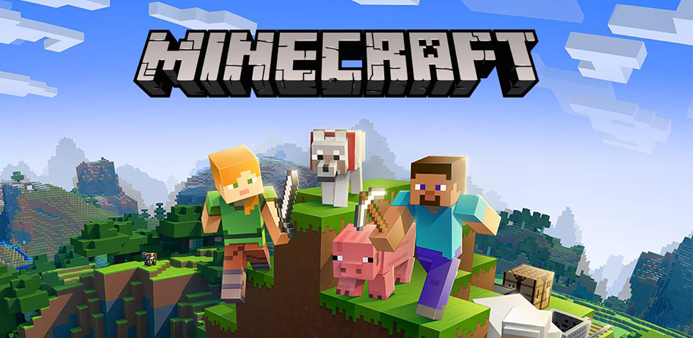
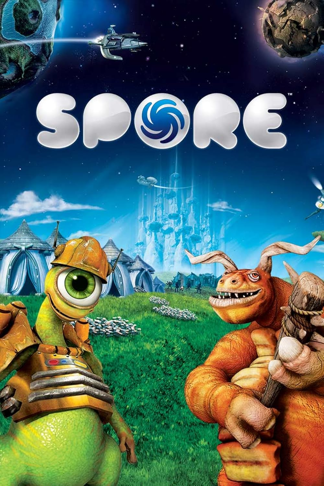

<!-- PROJECT LOGO -->
<br />
<div align="center">
  <a href="https://github.com/MrFreedy/The-Legend-of-The-Duck">
    
  </a>

  <h3 align="center">The Legend of The Duck</h3>

  <p align="center">
    Un générateur procédural de donjon <br/>
    par<br/>
    AZAL Corp
     <br />
    Luc VALETTE
    ·
    Arthur LENNE
    ·
    Ziyad QUARRI
    ·
    Anas AMIRI
  </p>
</div>


<details>
  <summary>Sommaire</summary>
  <ol>
    <li>
      Présentation du projet
      <ul>
	      <li>Les fonctionnalités attendues</li>
	      <li>Les contraintes</li>
      </ul>
    </li>
    <li>
      Génération procédural
      <ul>
        <li>Prim</li>
        <ul>
	        <li>Prim c'est quoi ?</li>
	        <li>Notre utilisation</li>
		<li>Alors Prim c'est bien ?</li>
        </ul>
        <li>BSP</li>
        <ul>
	        <li>BSP c'est quoi ?</li>
	        <li>Notre utilisation</li>
		    <li>Alors BSP c'est bien ?</li>
        </ul>
      </ul>
    </li>
    <li>Outils de conception</li>
    <li>Fonctionnalités bonus ajoutés</li>
    <li>Conclusion</li>
    <li>Feedback du projet</li>
  </ol>
</details>


# Présentation du projet

Le but de ce projet était de concevoir de A à Z un générateur de donjon de façon PROCEDURAL.

Aujourd'hui, nous pouvons constater une pénurie de l'utilisation de la génération procédurale dans le monde du jeu vidéo, une approche innovante et prometteuse pour la création de mondes virtuels. La génération procédurale, en tant que méthode algorithmique pour produire des contenus de manière dynamique, offre des avantages significatifs en termes de diversité, de rejeu et d'évolutivité des environnements de jeu. Cependant, malgré son potentiel, de nombreux projets n'exploitent pas pleinement cette technologie, se limitant souvent à des aspects spécifiques du jeu.

Nous avons donc conçu ce jeu manière très simplifié d'un point de vue gameplay mais très enrichissant d'un point de vue génération procédurale.

En effet, nous avons décidé d'utiliser deux types de génération différents : Prim et BSP ,afin de pouvoir les comparer et offrir une meilleur expérience aux joueurs.


## Les fonctionnalités attendues
Après avoir pris contact avec notre client M.Roussille, nous avons pu dresser une liste des fonctionnalités attendues par ce dernier dans ce projet : 
-   Génération aléatoire de la carte du donjon avec des salles, des couloirs, et des zones secrètes.
-  Création d’énigmes basées sur le principe “Lock and Key” pour accéder à certaines parties du donjon.
-  Gestion des objets (clés, trésors, armes, etc.) dans le donjon.  
-  Création d’une interface utilisateur graphique pour afficher la carte du donjon et permettre à l’utilisateur de se déplacer et d’interagir avec les éléments du jeu.

## Les contraintes
La seule contrainte à laquelle nous avons été soumis est Java. En effet, le client voulait que le projet soit entièrement développé avec Java. Toutefois, nous étions libre sur l'utilisation d'utilitaires/ frameworks.

Cet contrainte d'utilisation ne nous a pas gêné même si d'autres langages auraient plus adaptés afin de créer un jeu vidéo tel que C#.


# Génération procédural

Jusqu'à présent nous n'avons pas expliquer "Qu'est-ce que la génération procédural ?"

La génération procédurale est une méthode informatique pour créer du contenu de manière automatique en utilisant des règles et des algorithmes plutôt que de le concevoir manuellement. Cela permet de générer des mondes, des niveaux de jeux vidéo, des paysages, des textures, des musiques, etc., de manière dynamique et souvent infinie, offrant ainsi une variété et une re-jouabilité uniques.

Sur ce projet, nous allons nous focaliser sur son utilisation dans le monde du jeu vidéo. En effet, comme évoqué plutôt la génération procédurale est rare dans ce domaine mais elle existe :
<div align="center">
<a href="https://fr.wikipedia.org/wiki/Minecraft">
    
  </a>
<a href="https://fr.wikipedia.org/wiki/Lethal_Company">
    
  </a>
  <a href="https://fr.wikipedia.org/wiki/Spore_(jeu_vidéo)">
    
  </a>
</div

## Prim

### Prim c'est quoi ?
L'algorithme de Prim est une technique utilisée en génération procédurale pour créer des arbres de recouvrement minimum dans un graphe. En termes simples, cela signifie qu'il trouve un ensemble d'arêtes qui connectent tous les nœuds du graphe tout en minimisant la somme de leurs poids. En d'autres termes, il aide à créer un réseau de connexion efficace entre différentes parties d'un monde généré de manière procédurale, comme des routes dans un jeu vidéo ou des chemins dans une carte.<br>


### Notre utilisation
Nous avons opté pour l'utilisation de l'algorithme de Prim dans notre projet de création de donjon pour plusieurs raisons essentielles. Tout d'abord, l'algorithme de Prim est reconnu pour sa capacité à générer des structures de données optimales, ce qui est particulièrement pertinent dans la conception de donjons où la disposition des salles et des couloirs peut avoir un impact significatif sur l'expérience du joueur.

En choisissant l'algorithme de Prim, nous nous assurons de créer un réseau de salles et de passages qui maximise l'accessibilité tout en minimisant les distances parcourues. Cela garantit que notre donjon offre un niveau de défi approprié et une exploration fluide pour les joueurs.

De plus, la simplicité de l'algorithme de Prim facilite son intégration dans notre code de génération procédurale. Nous pouvons le personnaliser selon nos besoins spécifiques, que ce soit pour introduire des éléments de variation dans la conception des donjons ou pour ajuster la difficulté en fonction des préférences des joueurs.

En résumé, l'algorithme de Prim offre une approche éprouvée et efficace pour la génération procédurale de donjons, garantissant ainsi une expérience de jeu immersive et stimulante pour les joueurs. Son utilisation constitue un choix stratégique qui contribue à la qualité et à la jouabilité de notre projet.

### Alors Prim c'est bien ?

L'algorithme de Prim est un choix judicieux pour la génération procédurale de donjons. Sa capacité à créer des structures de données optimales en minimisant les distances parcourues tout en maximisant l'accessibilité en fait un outil précieux pour concevoir des environnements de jeu complexes et engageants. Sa simplicité d'implémentation et sa flexibilité permettent également une adaptation facile aux besoins spécifiques du projet. En résumé, Prim offre une solution efficace et éprouvée pour la génération de donjons, offrant une expérience de jeu variée et captivante pour les joueurs.

Toutefois, il existe différents inconvénients comme la prévisibilité. En effet, l'algorithme de Prim suit une approche déterministe, les donjons générés peuvent parfois sembler prévisibles pour les joueurs expérimentés. Cela peut réduire la surprise et l'excitation liées à l'exploration. et sera donc corrélé à un autre inconvénient, le manque de variété. En raison de sa nature algorithmique, l'algorithme de Prim peut produire des donjons qui partagent des similitudes structurelles, ce qui peut entraîner une sensation de répétitivité dans le gameplay.

## BSP
### BSP c'est quoi ?
La génération par BSP (Binary Space Partitioning) est une méthode informatique pour créer des environnements en divisant répétitivement des espaces en deux parties, généralement de manière binaire, jusqu'à ce que des conditions spécifiques soient satisfaites. Cela permet de créer des structures de manière modulaire et efficace, souvent utilisée pour générer des niveaux de jeux vidéo ou des cartes en 3D. 


De célèbres vieux jeux vidéos utilisent cette méthode : 

<a href="https://en.wikipedia.org/wiki/Half-Life_(video_game)">
    
  </a>
<a href="https://en.wikipedia.org/wiki/Doom_(1993_video_game)">
    
  </a>

### Notre utilisation
Nous avons décidé d'utiliser l'algorithme BSP (Binary Space Partitioning) car il offre une méthode efficace pour générer des donjons complexes en divisant l'espace du donjon en sous-ensembles de manière récursive. Cette approche permet de créer des donjons variés et détaillés de manière cohérente, offrant une expérience de jeu riche et immersive pour les joueurs. En utilisant l'algorithme BSP, nous pouvons garantir la génération de donjons modulaires et dynamiques, ce qui est essentiel pour maintenir l'intérêt des joueurs sur la durée. Chaque exploration offre une nouvelle expérience, offrant ainsi une rejouabilité importante.

En résumé, l'utilisation de l'algorithme BSP dans notre projet nous permet de garantir des donjons variés, dynamiques et adaptés à l'expérience de jeu que nous souhaitons offrir aux joueurs. Son utilisation contribuera à créer une expérience immersive et captivante, où chaque exploration réserve de nouvelles surprises et défis.
### Alors BSP c'est bien ?
L'utilisation de l'algorithme BSP pour la création de niveaux de donjon dans notre jeu présente des avantages et des inconvénients à considérer. 
En ce qui concerne les avantages, BSP nous permet de générer des donjons avec une structure complexe offrant une variété d'itinéraires, de salles et de passages, ce qui rend l'exploration pour les joueurs plus captivante. De plus, cette approche permet une optimisation des performances en réduisant la charge graphique grâce à la minimisation du nombre de surfaces visibles à tout moment, améliorant ainsi la fluidité du jeu. 

En outre, BSP offre une adaptabilité dynamique en permettant la génération de niveaux en temps réel, ce qui est particulièrement utile pour un jeu de donjon où les environnements doivent être générés de manière procédurale. 

Cependant, l'utilisation de BSP peut également présenter des inconvénients, notamment un potentiel manque de variété dans les niveaux générés, une complexité de conception qui peut poser des défis aux développeurs et la possibilité de blocages ou de problèmes de conception qui nécessitent une gestion supplémentaire pour garantir une expérience de jeu fluide. 

En résumé, bien que BSP offre des avantages significatifs, il est important d'évaluer attentivement ses inconvénients potentiels et de considérer les besoins spécifiques du projet pour déterminer si c'est la meilleure approche pour notre jeu de donjon procédural.


# Outils de conception

Pour réaliser ce projet, nous avons utiliser différents outils/langages :

* [![Java][Java]][Java-url]<br>
  Ce langage nous a été imposé<br>
  
* [![Gradle]][Gradle-url]<br>
  Nous a permis de gérer<br>
  
* Checksyle<br>
  Nous a permis de fixer une norme d'écriture au sein de l'équipe.<br>
  
* Github Project<br>
  Nous a permis de nous répartir les tâches et de réaliser des reviews de code.<br>
  
* XML<br>
  Nous a permis de stocker certains paramètres du jeu<br>


#Fonctionnalités bonus ajoutés
Dans le cadre de notre projet, nous avons pris l'initiative d'ajouter trois fonctionnalités visant à rendre l'expérience plus accessible et adaptable aux utilisateurs :

* Paramètres personnalisables :
  Nous avons intégré un système de paramètres flexibles, permettant aux utilisateurs de personnaliser divers aspects du jeu selon leurs préférences. Ces paramètres se situent dans
  ```sh
  java/src/data/config.xml
   ```
  
* Système de langues multiples : Pour accueillir un public plus large, nous avons implémenter la possibilité de changer la langue du jeu en offrant la possibilité de modifier les textes. Pour cela, l'utilisateur devra dans un premier temps modifier la langue dans son fichier ```config.xml``` et ensuite ajouter son propre fichier langue respectant celui de base : 
```sh
java/src/data/language/french.xml # celui de base
java/src/data/language/[Votre langue].xml # votre propre fichier respectant la même structure que french.xml
   ```

* Enigmes personnalisables : Nous avons également implémenté un système d'énigmes modifiables à souhait, offrant aux utilisateurs la possibilité de créer, modifier ou personnaliser des énigmes selon leurs préférences. Cela permet une expérience de jeu plus interactive et permet aux joueurs de s'engager davantage avec le contenu du jeu. Pour cela, il suffit de modifier en respectant la norme d'écriture :
  ```sh
  java/src/data/enigmas.txt 
  ```

En intégrant ces fonctionnalités, nous visons à offrir une expérience de jeu inclusive et personnalisable, répondant aux besoins et aux préférences diversifiés de notre public cible.


# Bilan

Le projet "The Legend of The Duck" a été une expérience enrichissante et gratifiante pour toute l'équipe d'AZAL Corp. Nous avons réussi à créer un générateur de donjons procédural utilisant deux approches différentes : l'algorithme de Prim et la génération par BSP. Cette diversité nous a permis d'explorer les forces et les faiblesses de chaque méthode, tout en offrant une expérience de jeu variée aux utilisateurs.

Les fonctionnalités principales du projet, telles que la génération aléatoire de la carte du donjon, la création d'énigmes et la gestion des objets, ont été implémentées avec succès. De plus, nous avons ajouté des fonctionnalités bonus, telles que les paramètres personnalisables, le système de langues multiples et les énigmes modifiables à souhait, pour rendre le jeu plus accessible et adaptable aux différents utilisateurs.

L'utilisation d'outils de gestion de projet tels que GitHub Project et les normes de développement telles que Checkstyle ont grandement facilité la collaboration au sein de l'équipe et ont contribué à maintenir un code propre et bien structuré.

En termes de contraintes, l'exigence d'utiliser exclusivement Java comme langage de programmation a été respectée, bien que d'autres langages comme C# auraient pu être plus adaptés pour ce type de projet de jeu vidéo.


# Feedback

Dans l'ensemble, le projet a été une réussite, mais il reste des domaines où des améliorations pourraient être apportées. 

## Points positifs :
- La diversité des fonctionnalités et des approches de génération procédurale a enrichi l'expérience de jeu.
- L'implémentation des fonctionnalités bonus a rendu le jeu plus personnalisable et accessible à un plus large public.
- La collaboration au sein de l'équipe a été efficace grâce à l'utilisation d'outils de gestion de projet.

## Points à améliorer :
- Une plus grande variété dans la génération des donjons pourrait être introduite pour éviter la répétitivité.
- Une documentation plus détaillée et des instructions d'utilisation pourraient être fournies pour guider les utilisateurs dans la personnalisation du jeu.
- Une optimisation des performances pourrait être envisagée pour garantir une expérience de jeu fluide sur différents types de plates-formes.

En conclusion, le projet "The Legend of The Duck" a été une expérience enrichissante qui nous a permis d'explorer les techniques de génération procédurale et de créer un jeu de donjon captivant. Avec quelques ajustements et améliorations, nous sommes convaincus que le jeu pourrait offrir une expérience encore plus immersive et engageante pour les joueurs.

## Retours personnel :
### Arthur :

J'ai trouvé ce projet très enrichissant car il permet d'aborder un thème dont tout le monde entend parler mais dont personne ne sait comment il fonctionne. Pour moi, ce projet représente m'a permis de mettre en pratique ce que j'ai appris en entreprise dans la gestion des répartitions de tâches, du review de code, ....
Ce que je trouve regrettable, c'est qu'il est compliqué de motiver les autres à travailler. Il faut les pousser alors que ce n'est pas rôle car je ne suis pas chef de projet.

### Luc :

### Ziyad :

### Anas :
<!-- MARKDOWN LINKS & IMAGES -->
[Java]: https://img.shields.io/badge/Java-ED8B00?style=for-the-badge&logo=java&logoColor=white
[Gradle]: https://img.shields.io/badge/Gradle-02303A?style=for-the-badge&logo=Gradle&logoColor=white
[Gradle-url]: https://gradle.org
[Java-url]: https://www.java.com/fr/
