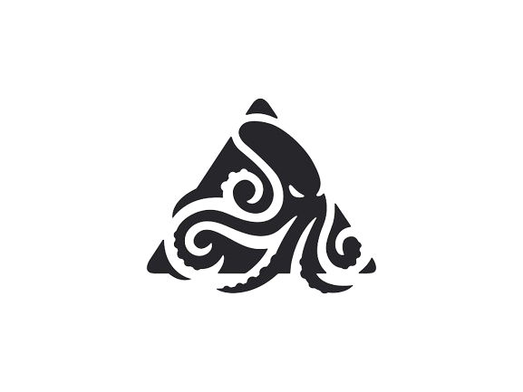

<!-- PROJECT LOGO -->
<br />
<div align="center">
  <a href="https://github.com/othneildrew/Best-README-Template">
    
  </a>

  <h3 align="center">The Legend of The Duck</h3>

  <p align="center">
    Un générateur procédural de donjon <br/>
    par<br/>
    AZAL Corp
     <br />
    Luc VALETTE
    ·
    Arthur LENNE
    ·
    Ziyad QUARRI
    ·
    Anas AMIRI
  </p>
</div>


<details>
  <summary>Sommaire</summary>
  <ol>
    <li>
      <a href="#presentation">Présentation du projet</a>
      <ul>
	      <li><a href="#attentes">Les fonctionnalités attendues</a></li>
	      <li><a href="#contraintes">Les contraintes</a></li>
      </ul>
    </li>
    <li>
      <a href="#generation-presentation">Génération procédural</a>
      <ul>
        <li><a href="#prim">Prim</a></li>
        <ul>
	        <li><a href="#prim-presentation">Prim c'est quoi ?</a></li>
	        <li><a href="#prim-code">Notre utilisation</a></li>
		    <li><a href="#prim-feedback">Alors Prim c'est bien ?</a></li>
        </ul>
        <li><a href="#bsp">BSP</a></li>
        <ul>
	        <li><a href="#bsp-presentation">BSP c'est quoi ?</a></li>
	        <li><a href="#bsp-code">Notre utilisation</a></li>
		    <li><a href="#bsp-feedback">Alors BSP c'est bien ?</a></li>
        </ul>
      </ul>
    </li>
    <li><a href="#outils">Outils de conception</a></li>
    <li><a href="#bonus">Fonctionnalités bonus ajoutés</a></li>
    <li><a href="#license">License</a></li>
    <li><a href="#bilan">Conclusion</a></li>
    <li><a href="#feedback-projet">Feedback du projet</a></li>
  </ol>
</details>


# Présentation du projet

[![Product Name Screen Shot][product-screenshot]](https://example.com)

Le but de ce projet était de concevoir de A à Z un générateur de donjon de façon PROCEDURAL.

Aujourd'hui, nous pouvons constater une pénurie de l'utilisation de la génération procédurale dans le monde du jeu vidéo, une approche innovante et prometteuse pour la création de mondes virtuels. La génération procédurale, en tant que méthode algorithmique pour produire des contenus de manière dynamique, offre des avantages significatifs en termes de diversité, de rejeu et d'évolutivité des environnements de jeu. Cependant, malgré son potentiel, de nombreux projets n'exploitent pas pleinement cette technologie, se limitant souvent à des aspects spécifiques du jeu.

Nous avons donc conçu ce jeu manière très simplifié d'un point de vue gameplay mais très enrichissant d'un point de vue génération procédurale.

En effet, nous avons décidé d'utiliser deux types de génération différents : Prim et BSP ,afin de pouvoir les comparer et offrir une meilleur expérience aux joueurs.


<p align="right">(<a href="#readme-top">Retour au sommaire</a>)</p>

## Les fonctionnalités attendues
Après avoir pris contact avec notre client M.Roussille, nous avons pu dresser une liste des fonctionnalités attendues par ce dernier dans ce projet : 
-   Génération aléatoire de la carte du donjon avec des salles, des couloirs, et des zones secrètes.
-  Création d’énigmes basées sur le principe “Lock and Key” pour accéder à certaines parties du donjon.
-  Gestion des objets (clés, trésors, armes, etc.) dans le donjon.  
-  Création d’une interface utilisateur graphique pour afficher la carte du donjon et permettre à l’utilisateur de se déplacer et d’interagir avec les éléments du jeu.

## Les contraintes
La seule contrainte à laquelle nous avons été soumis est Java. En effet, le client voulait que le projet soit entièrement développé avec Java. Toutefois, nous étions libre sur l'utilisation d'utilitaires/ frameworks.

Cet contrainte d'utilisation ne nous a pas gêné même si d'autres langages auraient plus adaptés afin de créer un jeu vidéo tel que C#.

## Outils de conception

Nous allons vous présenter les différents outils de conception que nous avons décidé d'utiliser afin de réaliser ce projet.

* [![Java][Java]][Java-url]
* [![Gradle]][Gradle-url]
* Checksyle
* Github Project
* XML

<p align="right">(<a href="#readme-top">Retour au sommaire</a>)</p>


# Génération procédural

Jusqu'à présent nous n'avons pas expliquer "Qu'est-ce que la génération procédural ?"

La génération procédurale est une méthode informatique pour créer du contenu de manière automatique en utilisant des règles et des algorithmes plutôt que de le concevoir manuellement. Cela permet de générer des mondes, des niveaux de jeux vidéo, des paysages, des textures, des musiques, etc., de manière dynamique et souvent infinie, offrant ainsi une variété et une re-jouabilité uniques.

Sur ce projet, nous allons nous focaliser sur son utilisation dans le monde du jeu vidéo. En effet, comme évoqué plutôt la génération procédurale est rare dans ce domaine mais elle existe :
<div align="center">
<a href="https://fr.wikipedia.org/wiki/Minecraft">
    
  </a>
<a href="https://fr.wikipedia.org/wiki/Lethal_Company">
    
  </a>
  <a href="https://fr.wikipedia.org/wiki/Spore_(jeu_vidéo)">
    
  </a>
</div

## Prim

### Prim c'est quoi ?
L'algorithme de Prim est une technique utilisée en génération procédurale pour créer des arbres de recouvrement minimum dans un graphe. En termes simples, cela signifie qu'il trouve un ensemble d'arêtes qui connectent tous les nœuds du graphe tout en minimisant la somme de leurs poids. En d'autres termes, il aide à créer un réseau de connexion efficace entre différentes parties d'un monde généré de manière procédurale, comme des routes dans un jeu vidéo ou des chemins dans une carte.

### Notre utilisation

### Alors Prim c'est bien ?

This is an example of how to list things you need to use the software and how to install them.
* npm
  ```sh
  npm install npm@latest -g
  ```

## BSP
### BSP c'est quoi ?

### Notre utilisation

### Alors BSP c'est bien ?
_Below is an example of how you can instruct your audience on installing and setting up your app. This template doesn't rely on any external dependencies or services._

1. Get a free API Key at [https://example.com](https://example.com)
2. Clone the repo
   ```sh
   git clone https://github.com/your_username_/Project-Name.git
   ```
3. Install NPM packages
   ```sh
   npm install
   ```
4. Enter your API in `config.js`
   ```js
   const API_KEY = 'ENTER YOUR API';
   ```

<p align="right">(<a href="#readme-top">back to top</a>)</p>


<!-- USAGE EXAMPLES -->
## Usage

Use this space to show useful examples of how a project can be used. Additional screenshots, code examples and demos work well in this space. You may also link to more resources.

_For more examples, please refer to the [Documentation](https://example.com)_

<p align="right">(<a href="#readme-top">back to top</a>)</p>


<!-- ROADMAP -->
## Roadmap

- [x] Add Changelog
- [x] Add back to top links
- [ ] Add Additional Templates w/ Examples
- [ ] Add "components" document to easily copy & paste sections of the readme
- [ ] Multi-language Support
    - [ ] Chinese
    - [ ] Spanish

See the [open issues](https://github.com/othneildrew/Best-README-Template/issues) for a full list of proposed features (and known issues).

<p align="right">(<a href="#readme-top">back to top</a>)</p>


<!-- CONTRIBUTING -->
## Contributing

Contributions are what make the open source community such an amazing place to learn, inspire, and create. Any contributions you make are **greatly appreciated**.

If you have a suggestion that would make this better, please fork the repo and create a pull request. You can also simply open an issue with the tag "enhancement".
Don't forget to give the project a star! Thanks again!

1. Fork the Project
2. Create your Feature Branch (`git checkout -b feature/AmazingFeature`)
3. Commit your Changes (`git commit -m 'Add some AmazingFeature'`)
4. Push to the Branch (`git push origin feature/AmazingFeature`)
5. Open a Pull Request

<p align="right">(<a href="#readme-top">back to top</a>)</p>


<!-- LICENSE -->
## License

Distributed under the MIT License. See `LICENSE.txt` for more information.

<p align="right">(<a href="#readme-top">back to top</a>)</p>


<!-- CONTACT -->
## Contact

Your Name - [@your_twitter](https://twitter.com/your_username) - email@example.com

Project Link: [https://github.com/your_username/repo_name](https://github.com/your_username/repo_name)

<p align="right">(<a href="#readme-top">back to top</a>)</p>


<!-- ACKNOWLEDGMENTS -->
## Acknowledgments

Use this space to list resources you find helpful and would like to give credit to. I've included a few of my favorites to kick things off!

* [Choose an Open Source License](https://choosealicense.com)
* [GitHub Emoji Cheat Sheet](https://www.webpagefx.com/tools/emoji-cheat-sheet)
* [Malven's Flexbox Cheatsheet](https://flexbox.malven.co/)
* [Malven's Grid Cheatsheet](https://grid.malven.co/)
* [Img Shields](https://shields.io)
* [GitHub Pages](https://pages.github.com)
* [Font Awesome](https://fontawesome.com)
* [React Icons](https://react-icons.github.io/react-icons/search)

<p align="right">(<a href="#readme-top">back to top</a>)</p>


<!-- MARKDOWN LINKS & IMAGES -->
<!-- https://www.markdownguide.org/basic-syntax/#reference-style-links -->
[contributors-shield]: https://img.shields.io/github/contributors/othneildrew/Best-README-Template.svg?style=for-the-badge
[contributors-url]: https://github.com/othneildrew/Best-README-Template/graphs/contributors
[forks-shield]: https://img.shields.io/github/forks/othneildrew/Best-README-Template.svg?style=for-the-badge
[forks-url]: https://github.com/othneildrew/Best-README-Template/network/members
[stars-shield]: https://img.shields.io/github/stars/othneildrew/Best-README-Template.svg?style=for-the-badge
[stars-url]: https://github.com/othneildrew/Best-README-Template/stargazers
[issues-shield]: https://img.shields.io/github/issues/othneildrew/Best-README-Template.svg?style=for-the-badge
[issues-url]: https://github.com/othneildrew/Best-README-Template/issues
[license-shield]: https://img.shields.io/github/license/othneildrew/Best-README-Template.svg?style=for-the-badge
[license-url]: https://github.com/othneildrew/Best-README-Template/blob/master/LICENSE.txt
[linkedin-shield]: https://img.shields.io/badge/-LinkedIn-black.svg?style=for-the-badge&logo=linkedin&colorB=555
[linkedin-url]: https://linkedin.com/in/othneildrew
[product-screenshot]: images/screenshot.png


[Java]: https://img.shields.io/badge/Java-ED8B00?style=for-the-badge&logo=java&logoColor=white
[Gradle]: https://img.shields.io/badge/Gradle-02303A?style=for-the-badge&logo=Gradle&logoColor=white
[Gradle-url]: https://gradle.org
[Java-url]: https://www.java.com/fr/

[React.js]: https://img.shields.io/badge/React-20232A?style=for-the-badge&logo=react&logoColor=61DAFB
[React-url]: https://reactjs.org/
[Vue.js]: https://img.shields.io/badge/Vue.js-35495E?style=for-the-badge&logo=vuedotjs&logoColor=4FC08D
[Vue-url]: https://vuejs.org/
[Angular.io]: https://img.shields.io/badge/Angular-DD0031?style=for-the-badge&logo=angular&logoColor=white
[Angular-url]: https://angular.io/
[Svelte.dev]: https://img.shields.io/badge/Svelte-4A4A55?style=for-the-badge&logo=svelte&logoColor=FF3E00
[Svelte-url]: https://svelte.dev/
[Laravel.com]: https://img.shields.io/badge/Laravel-FF2D20?style=for-the-badge&logo=laravel&logoColor=white
[Laravel-url]: https://laravel.com
[Bootstrap.com]: https://img.shields.io/badge/Bootstrap-563D7C?style=for-the-badge&logo=bootstrap&logoColor=white
[Bootstrap-url]: https://getbootstrap.com
[JQuery.com]: https://img.shields.io/badge/jQuery-0769AD?style=for-the-badge&logo=jquery&logoColor=white
[JQuery-url]: https://jquery.com 
